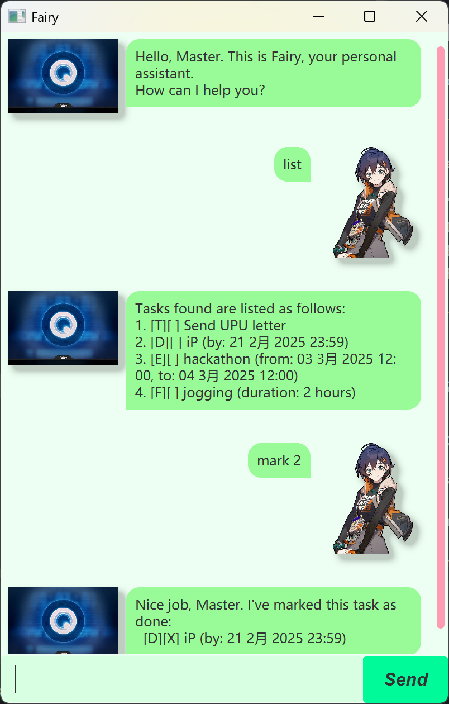

# Fairy User Guide

Fairy is a personal assistant that can help you manage tasks, used in a fashion of command line interface (CLI)
which uses commands to instruct our chatbot, while still persists features of Graphical User Interface (GUI)
for better user experience.

There are 4 kinds of tasks that our chatbot can handle:

- **ToDo**: normal task with no time attributes.
- **Deadline**: task with an end time.
- **Event**: task with start time and end time.
- **Fixed Duration**: task with no specific start and end time but with specific duration.

Fairy also supports marking tasks as done, and search task by name or date.

"Fairy", the name of the chatbot, comes from an AI assistant in game *Zenless Zone Zero*.

## Instruction

1. Install Java `17` or above in your computer. Skip this step if you already have one installed.
2. Download our latest release in `.jar` file from [here](https://github.com/feconi1024/ip/releases).
3. Copy the `.jar` file to the folder you wish to use as the home directory of the program.
4. Open a command terminal from your folder. Use `java -jar fairy.jar` command to run the application.
You may also try to double-click the file to open.
5. Type command in the text field and send it by pushing "Enter" key or clicking "Send" button for operations.

## Features

> [!NOTE]
> 
> - In command formats, `UPPER_CASE` are used to represent parameters specified by the users.\
> e.g. in `todo NAME`, `NAME` is specified by the user which can be used as `todo Send messages`.
> Space is accepted as a separator in all parameters.
> - Parameters are separated by flags which starts with a slash `/`.\
> e.g. in `deadline NAME /by TIME` two parameters `NAME` and `TIME` are separated by flag `/by`.
> - Parameters **MUST** be in the order given in formats.\
> e.g. in `event NAME /from START_TIME /by END_TIME`, you cannot reverse the order of `/from START_TIME` and
> `/to END_TIME`.
> - Extraneous parameters for commands that do no take any parameters (such as `list` and `bye`) will be ignored.\
> e.g. command `list 123` will be interpreted as `list`.

> [!IMPORTANT]
> 
> - All `TIME` parameters specified by user should be in format: `YYYYMMDD HHMM`.\
> e.g. `20250302 2359` means 11.59 p.m. on 2 March 2025.
>   - `YYYY` is year in 4 digits. e.g. `2025`.
>   - `MM` is month in 2 digits. e.g. `03` means March.
>   - `DD` is day in 2 digits. e.g. `01`.
>   - `HH` is hour in 24-hour system. e.g. `15` means 3 p.m.
>   - `MM` is minute in 2-digits. e.g. `00`.
> - All `DATE` parameters specified by user should be in format: `YYYYMMDD`.\
> e.g. `20250301` means 1 March 2025.

### Adding a todo task: `todo`

Adds a todo task to the list.

Format: `todo NAME`

Example: `todo CS2103T HW`

### Adding a deadline task: `deadline`

Adds a deadline task to the list.

Format: `deadline NAME /by TIME`

Example: `deadline CS2103T HW /by 20250101 0000`

### Adding an event task: `event`

Adds an event to the list.

Format: `event NAME /from START_TIME /to END_TIME`

- Start time should be before end time.\
e.g. `20250101 1000` and `20250101 0959` is not a valid start-end time pair because 9.59 a.m. (end time)
is before 10.00 a.m. (start time).

Example: `event CS2103T field trip /from 20250101 0000 /to 20250101 2359`

### Adding a fixed duration task: `fixdur`

Adds a fixed duration task to the list.

Format: `fixdur NAME /dur DURATION`

- Duration must be a **positive integer**, in hours.

Example: `fixdur Jogging /dur 1` adds a fixed duration task `Jogging` with duration `1` hour.

### Deleting a task: `delete`

Deletes a task from the list.

Format: `delete INDEX`

- Deletes the task at the specified `INDEX`.
- The index starts from `1`. 
- Lookup for the list of indexed tasks using `list` command.

Example: `delete 6` deletes the 6th task in the list.

### Marking a task as completed: `mark`

Marks a task from the list as completed.

Format: `mark INDEX`

- Marks the task at the specified `INDEX` as completed.
- The index starts from `1`. 
- Lookup for the list of indexed tasks using `list` command.

Example: `mark 6` marks the 6th task in the list as completed.

### Marking a task as incomplete: `unmark`

Marks a task from the list as incomplete.

Format: `unmark INDEX`

- Marks the task at specified `INDEX` as incomplete.
- The index starts from `1`. 
- Lookup for the list of indexed tasks using `list` command.

Example: `unmark 6` marks the 6th task in the list as incomplete.

### Listing all tasks: `list`

Lists all the tasks in the list with index attached.

Format: `list`

Output of line: `INDEX. [TYPE][COMPLETE] NAME (INFO)`
- `INDEX` is the position of the task in the list, starting from `1`.
- `TYPE` is a single character representing the type of task. `T` represents Todo, `D` represents Deadline,
`E` represents Event and `F` represents Fixed Duration.
- `COMPLETE` is the completion status of the task. A `X` mark is used to represent a completed task.
- `INFO` is more information about the task, such as start and end time.

Example of output: `1. [E][X] Hackathon (from: 03 Mar 2025 12:00, to: 04 Mar 2025 12:00)`
represents the first task in the list, which is a completed hackathon started and ended at time specified.

### Searching task by keyword: `find`

Finds all tasks that contains the keyword in their names.

Format: `find KEYWORD`

- The search is case-insensitive. e.g. `play` matches `Play`.
- Part of word will also be matched. e.g. `f` matches `Find`.

Example: `find upu` returns Todo task `Send UPU letter`.

### Searching task by date: `searchByDate`

Finds all deadline tasks that ends on the date specified and all event tasks that happens on the date specified.

Format: `searchByDate DATE`

Example: `searchByDate 20250303` returns the event `Hackathon`.